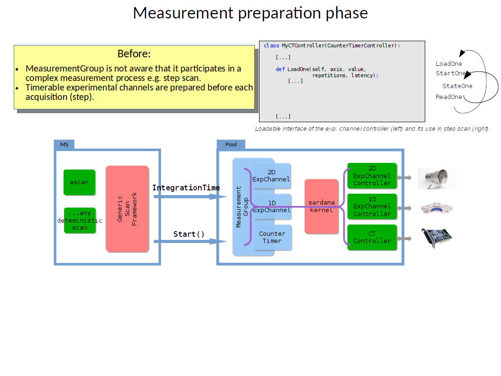
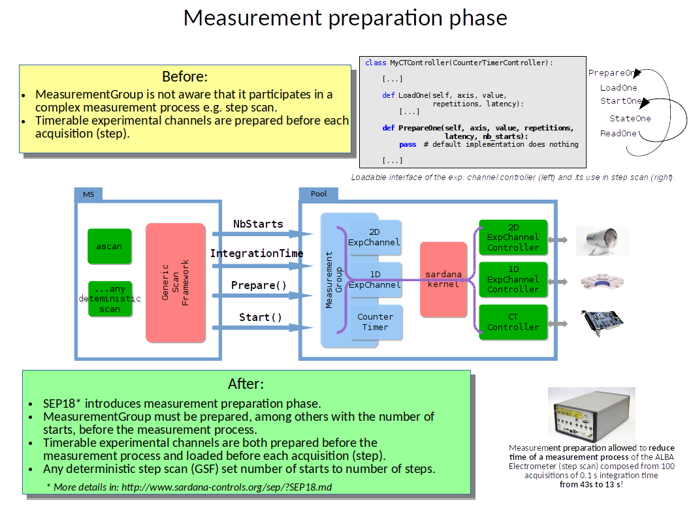

# SEP18

## Measurement group preparation

### Before SEP18:



### After SEP18:



**Important**:

* From SEP18 on, in order to start the measurement group, it is mandatory to 
prepare it.
* The measurement group is prepared for a number of starts. The preparation
will expire whenever all starts gets called or in case of stop/abort.
Afterwards measurement group requires another preparation.
* Direct start of the measurement group (after prior configuration of the
integration time or synchronization) will be supported as backwards
compatibility.

## Measurement group interface:

```
$> taurusdevicepanel mntgrp01
```

### Sardana-Taurus extension API:

* Enrich Taurus Device objects to facilitate Sardana elements manipulation e.g. state transition in motion and acquisition
* Don't use `tango.DeviceProxy`, use Sardana-Taurus extensions!
* Available in macros development: macro parameters, `Macro.getObj`, `Macro.getMeasurementGroup`, etc.
* Can be used in any python application, just register extension before getting Taurus Device:
  ```python
  from sardana.taurus.core.tango.sardana import registerExtensions()
  registerExtensions()
  ```
* Qt Sardana-Taurus extensions are also available for programming Qt applications - Tango events are mapped to Qt signals.

### Sardana-Taurus extension to MeasurementGroup

The following snippet is not a functional code and is just a partial API for demonstration purposes:

```python
class MeasurementGroup:

[...]

    def setConfiguration(self, configuration):
        [...]

    def setAcquisitionMode(self, acq_mode):
        [...]

    def setIntegrationTime(self, integ_time):
        [...]
    
    def setMonitorCount(self, monitor_count):
        [...]
    
    def setNbStarts(self, nb_starts):
        [...]

    def prepare(self):
        """Prepare the group.
        
        Load to the controllers the measurement parameters.
        """
        [...]

    def count_raw(self, start_time=None):
        """Raw count and report count values.

        Simply start and wait until finish, no configuration nor preparation.

        :param start_time: start time of the whole count operation, if not
          passed a current timestamp will be used
        :type start_time: :obj:`float`
        :return: channel names and values (or value references - experimental)
        :rtype: :obj:`dict` where keys are channel full names and values are
          channel values (or value references - experimental)
        """
        [...]

    def count(self, value):
        """Count and report count values.

        Configuration and prepare for measurement, then start and wait until
        finish.

        :param value: integration time or monitor count
        :return: channel names and values (or value references - experimental)
        :rtype: :obj:`dict` where keys are channel full names and values are
          channel values (or value references - experimental)
        """
        [...]

    def count_continuous(self, synchronization, value_buffer_cb=None):
        """Execute measurement process according to the given synchronization
        description.

        :param synchronization: synchronization description
        :type synchronization: list of groups with equidistant synchronizations
        :param value_buffer_cb: callback on value buffer updates
        :type value_buffer_cb: callable
        :return: state and eventually value buffers if no callback was passed
        :rtype: tuple<list<DevState>,<list>>
        """
        [...]

    def startCount(self):
        """Start count"""
        [...]

    def waitCount(self, timeout=None, id=None):
        """Wait for the count to finish

        :param timeout: optional timeout (seconds)
        :type timeout: float
        :param id: id of the opertation returned by start
        :type id: tuple(float))
        """
        [...]
[...]
```

## Sardana synchronization modes:


[AcqSynch](https://sardana-controls.org/devel/api/sardana/pool/pooldefs.html#sardana.pool.pooldefs.AcqSynch) was extended with two new options:
* SoftwareStart (which means internal start)
* HardwareStart (which means external start)

[AcqSynchType](https://sardana-controls.org/devel/api/sardana/pool/pooldefs.html#acqsynchtype) was extended with one new option (supported from expconf):
* Start


## Experimental channel preparation

```python
def PrepareOne(self, axis, value, repetitions, latency, nb_starts):
    [...]
```

```python
def LoadOne(self, axis, value, repetitions, latency):
    [...]
```

**Important**: Difference between measurement group number of starts and
experimental channel number of starts:

* Measurement group number of starts means how many times a measurement group
will be started by a Start command.
* Experimental channel number of starts means how many times an experimental
channel controller will be starter by `StartOne` method.

For example, in a continuous scan, the measurement group is started only once,
but an experimental channel controller synchronized by software is started
multiple times.

Check all the possible [combinations](https://github.com/sardana-org/sardana/blob/develop/doc/source/sep/SEP18.md#controllers).


## Further improvements in data acquisition

* [SEP17](https://github.com/sardana-org/sardana/pull/478): Ongoing 
acquisition formalization and implementation
  * made `Value` attribute of experimental channel always return the result of 
  the last acquisition - from the cache (or the current one if this one is 
  still in progress). `Value` attribute readout should never trigger readout
  from the controller. 
  * ongoing acquisition - see details in SEP17
* More information about the acquisition status apart from States: On, 
Moving, Alarm.
    * No coherence between Moving state in hardware and software acquisition
    * No distinction between waiting for trigger and acquiring
        * Standby value when waiting in armed state for synchronization event?
        * A dedicated attribute like acq_status in Lima?
* Bring measurement group elements to safe state when something goes wrong -
  not all the cases are supported.
* How to solve long prepare and start, Tango 3 s. timeout?
